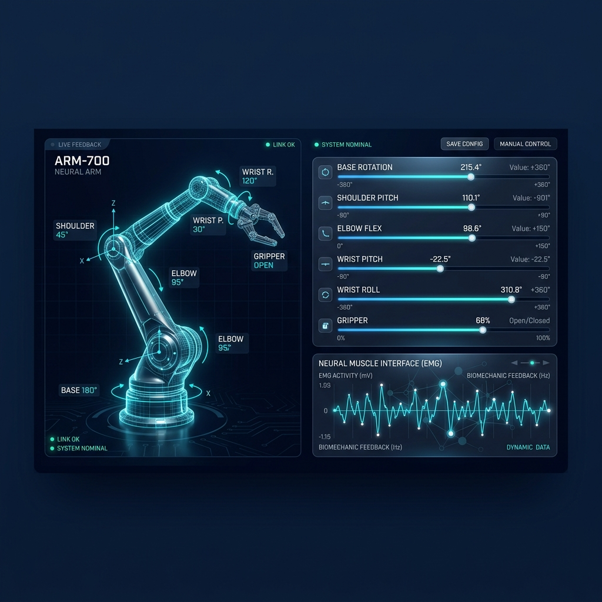
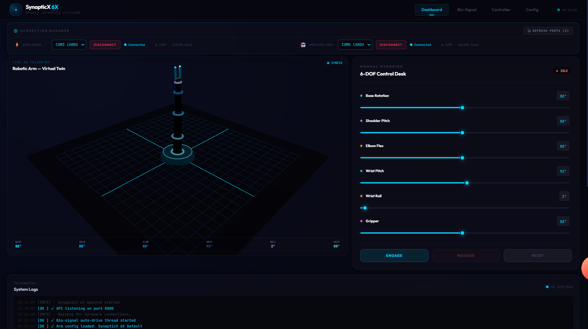
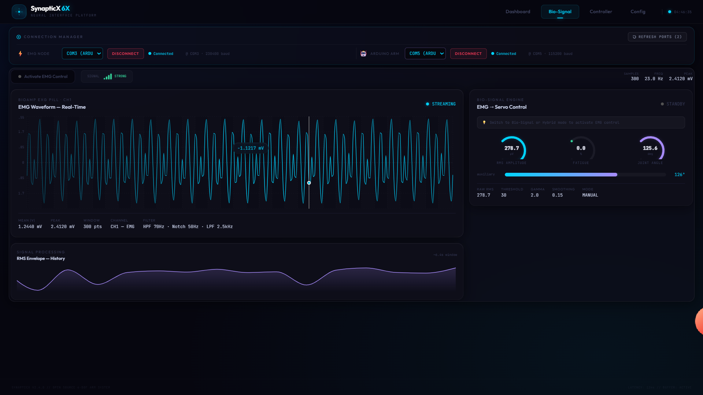
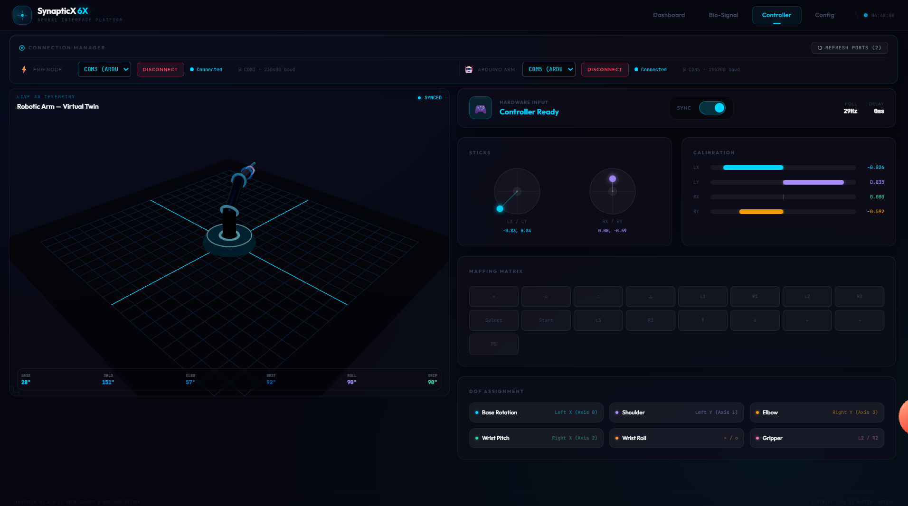

# 🧠 SynapticX 6X — Neural Augmented 6-DOF Robotic Platform

> **A high-fidelity, open-source 6-DOF robotic arm interface featuring a real-time 3D Virtual Twin, Bio-Signal (EMG) control, and Gamepad integration.**

---

## 🎥 System Demonstration

[](https://drive.google.com/file/d/1PlZM34aBiUlFGKWl7Hrb14IbHXf0pm27/view?usp=sharing)

**[Click here to watch the full system demonstration on Google Drive]**  
*(Optional: Download the local [HD Demo Video](media/demo_video.mp4) for offline viewing)*

---

## 🖼️ Interface Gallery

| Manual Override | Bio-Signal Diagnostics | Controller Mapping |
|:---:|:---:|:---:|
|  |  |  |
| *60:40 Viewport Split* | *Biological Window* | *Gamepad Telemetry* |

---

## 🚀 Key Features
- **3D Virtual Twin:** A low-latency 3D robotic model that mirrors the hardware state in real-time using a 10Hz synchronization loop.
- **60:40 Viewport Architecture:** Optimized layout featuring the 3D twin (60%) alongside precise manual overrides (40%).
- **Advanced Bio-Signal Engine:** Dedicated "Biological Window" for reading raw EMG data from the **BioAmp EXG Pill**, featuring RMS analysis and signal filtering.
- **Universal Gamepad Sync:** Plug-and-play support for PS4/PS5 and Xbox controllers with exponential response curves for organic movement.
- **Multi-Node Connection:** Managed serial links for both the EMG Acquisition Node and the 6-DOF Actuation Node.

---

## 🌐 Sim-to-Real & ROS Ecosystem
SynapticX 6X is built with a **Sim-to-Real first** philosophy. The platform bridges the gap between virtual simulation and physical execution:

- **RViz Visualization:** Native compatibility with ROS 2 and RViz. The backend serves as a ROS bridge, publishing `/joint_states` and subscribing to `/joint_commands`, allowing you to visualize kinematics and plan paths in a professional robotics environment.
- **Digital Twin Sync:** Every movement in the virtual environment (Three.js/React Three Fiber) is mirrored to the physical servos with sub-50ms latency, ensuring high-fidelity parity.
- **Unified URDF Workflow:** Designed to work with standard URDF models, enabling seamless transition from Gazebo simulations to real-world deployment.

---

## 🧠 Physical AI Dashboard: The Neural Bridge
The SynapticX Dashboard is more than just a UI; it is the central nervous system of the **Physical AI** architecture:

- **Neural Interface (EMG):** Real-time biological data (RMS, MAV, ZCR) is captured and processed through a DSP pipeline (HPF, LPF, Notch) to convert human muscle intent into robotic joint angles.
- **Telemetry Fusion:** The dashboard merges 3D kinematics, bio-signal waveforms, and hardware serial logs into a single glassmorphic viewport.
- **Closed-Loop Control:** Experience true "Physical AI" where biological inputs directly drive the 6-DOF actuator's logic, creating an organic link between human and machine.


## 🛠️ Tech Stack & Architecture

| Layer | Technology | Description |
|-------|-----------|-------------|
| **3D Rendering** | React Three Fiber / Three.js | Hardware-synchronized Virtual Twin |
| **Frontend** | React 19 + Vite + Tailwind | Glassmorphic, High-Density Interface |
| **Backend** | Python 3.10+ FastAPI | Real-time Serial IPC & State Engine |
| **Control** | Web Gamepad API | Direct Controller ↔ Hardware Bridge |
| **Signal Proc** | Recharts / Custom RMS | Live EMG Waveform & Frequency Analysis |

---

## 📂 Repository Structure

- `backend/`: FastAPI server handling serial communication, kinematics, and telemetry logs.
- `frontend/`: Modern React application.
- `arduino/`: Firmware for 6-DOF servo control and BioAmp analog reading.
- `media/`: High-resolution documentation and system previews.

---

## 🚦 Getting Started

### 1. Prerequisites
Ensure you have **Python 3.10+** and **Node.js 18+** installed.

### 2. Physical Setup
1. Connect your **BioAmp EXG Pill** to an Arduino (Node A).
2. Connect your **6-DOF Robotic Arm** to a separate Arduino (Node B).

### 3. Execution
```bash
# Terminal 1: Backend
cd backend
pip install -r requirements.txt
python main.py

# Terminal 2: Frontend
cd frontend
npm install
npm run dev
```
Open **http://localhost:5173** in your browser.

---

## 🔌 Hardware Configuration

The system is pre-configured for a standard 6-servo serial protocol:
`base,shoulder,elbow,wrist,gripper,auxiliary\n`

**Servo Mapping:**
- **Base Rotation:** Left Stick X (Axis 0)
- **Shoulder Pitch:** Left Stick Y (Axis 1)
- **Elbow Flex:** Right Stick Y (Axis 3) [Inverted for Physical Bot Sync]
- **Wrist Pitch:** Right Stick X (Axis 2)
- **Gripper:** L2 / R2 Proportional Control
- **Wrist Roll:** × / ○ (Button Pulse)

---

## 🧩 API & Data Protocol

| Endpoint | Method | Output |
|----------|--------|--------|
| `/system-status` | `GET` | Current joint angles & link health |
| `/servo/update` | `POST` | Real-time joint angle override |
| `/neural-data` | `GET` | Live EMG voltage buffer |
| `/logs` | `GET` | System-level telemetry stream |

---

## 📄 License & Attribution

Distributed under the **MIT License**. Free for research, hobbyist, and academic use.

**Author:** Shashwat Sahu — [@ShashwatSahu21](https://github.com/ShashwatSahu21)
**Project:** [SynapticX 6X - Neural Augmented Robotic Platform](https://github.com/ShashwatSahu21/synapticx-6x)
